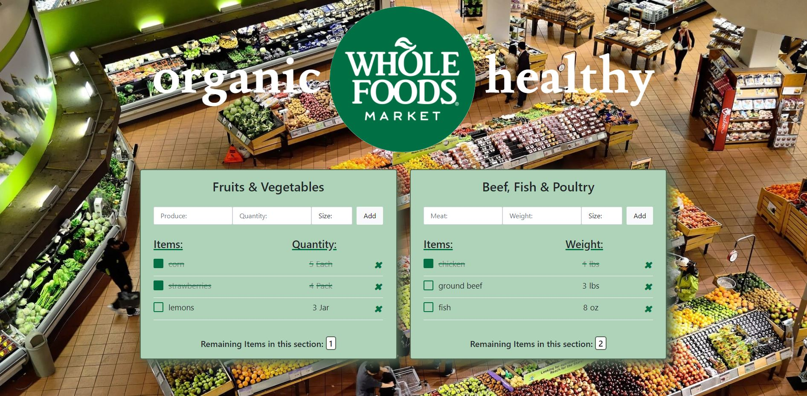
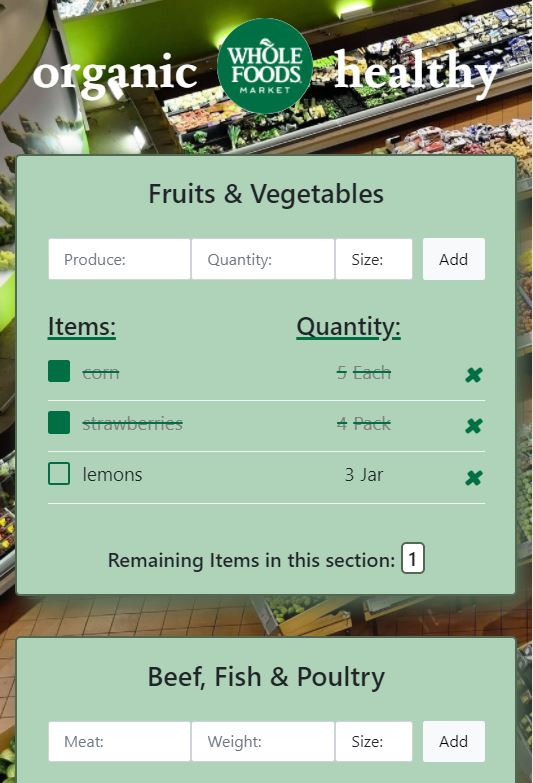

# Grocery Store App 

### Connect with me or view the application live: 

Contact me on Twitter at [@tamsauce] or LinkedIn at [@tami_hughes]
<<<<<<< HEAD
Click [here] to see the app in action.

## Images of App:
[]
[]
[]

=======

Click [here] to see the app in action.
>>>>>>> 7b7487c4250b931e9af5369aba9245e7cba9dff6
## _Designed to shorten your trips at the store:_ 
Full Stack, responsive, Grocery Store CRUD app.  

- Database -MongoDB
- JavaScript 
- NodeJs
- Express
- EJS
- Mobile Friendly

## Features

- Add items you need from the store by department
- Cross off items as you find them in the store 
- Delete items you no longer want on your list 
- Input fields include - store item, quantity needed and size
- Size field is a dropdown with pre-selected options 
- Export documents as Markdown, HTML and PDF
- Includes a remaining tally for each department 
> The overriding design goal for this app 
> was to allow users to shop by department 
> rather than having to zig zag back and  
> forth through isles.  
> The remaining feature allows the users to 
> quickly see how many more items they 
> have left to pick up before moving 
> on to the next section of the store.  


## Tech

Grocery Store App uses a number of open source projects to work properly:

- [MongoDB] - HTML enhanced for web apps!
- [Twitter Bootstrap] - great UI boilerplate for modern web apps
- [node.js] - evented I/O for the backend
- [Express] - fast node.js network app framework 


## Installation
App requires [Node.js](https://nodejs.org/) v14.16.0 to run.

Install the dependencies and devDependencies and start the server.

```sh
cd WholeFoodGroceryListFinal
npm i
node server
```

For production environments...

```sh
npm install --production
NODE_ENV=production node app
```


[//]: # (These are reference links used in the body of this note and get stripped out when the markdown processor does its job. There is no need to format nicely because it shouldn't be seen. Thanks SO - http://stackoverflow.com/questions/4823468/store-comments-in-markdown-syntax)

   [here]: <https://personal-grocery-store-list.herokuapp.com/>
   [git-repo-url]: <https://github.com/Tamsauce/GroceryList>
   [node.js]: <http://nodejs.org>
   [Twitter Bootstrap]: <http://twitter.github.com/bootstrap/>
   [@tamsauce]: <https://twitter.com/tamsaucce>
   [express]: <http://expressjs.com>
   [MongoDB]:<https://www.mongodb.com/>
   [@tami_hughes]:<https://www.linkedin.com/in/tami-hughes-58074a72/>
